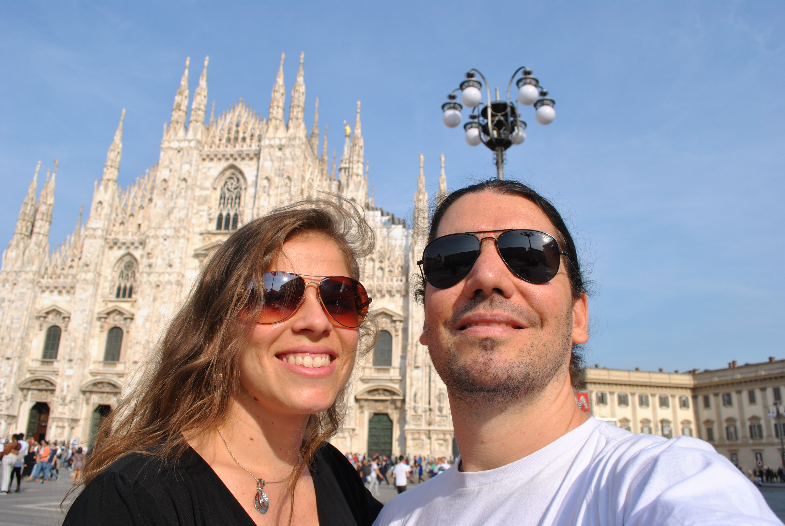

Jardins e viagens são parte do meu cultivo. Aqui compartilho um pouco do que
planto e colho.

## O que é um jardim?

Um jardim é um espaço cultivado onde plantas, flores e árvores são
cuidadosamente plantadas e cuidadas. É um lugar de beleza, tranquilidade e
conexão com a natureza. Jardins podem variar em tamanho e estilo, desde
pequenos canteiros em casa até grandes parques públicos. Eles são espaços que
refletem a criatividade e o cuidado de quem os cultiva, proporcionando um
ambiente propício para a contemplação e o relaxamento.

## O que é uma viagem?

Uma viagem é uma jornada para um lugar diferente, seja dentro do próprio país ou
em terras distantes. Viajar é uma forma de explorar novas culturas, paisagens e
experiências.
